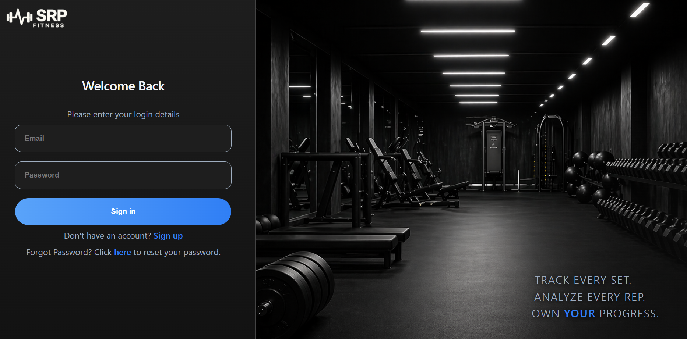

# Workout Tracker 🔩

A fitness-focused workout tracking application currently in development. The goal of the project is to provide users with an easy way to track workouts, manage exercise history, and eventually monitor nutrition and fitness progress in one centralized platform.

## Features

### Current Features
- User authentication with Firebase Authentication
- Email verification system
- User profile creation
- Exercise database integration
- React-based dashboard currently in development

### Planned Features
- Workout logging and history
- Progress tracking and analytics
- Nutrition and calorie tracking
- Custom workout routines
- Exercise search and filtering
- Responsive UI for desktop and mobile

## Tech Stack

- React
- JavaScript
- HTML/CSS
- Firebase
- Firebase Authentication
- Firestore Database
- Git & GitHub

## Screenshots



## How to Run

1. Clone the repository

```bash
git clone YOUR_REPOSITORY_URL
```

2. Navigate to the project folder

```bash
cd workout-tracker
```

3. Install project dependencies

```bash
npm install
```

4. Start the development server

```bash
npm run dev
```

5. Open the local development URL shown in the terminal (typically `http://localhost:5173`)

## Project Status

This project is currently in active development. The authentication system and profile creation features are functional, while the main dashboard and workout tracking systems are still being developed.

## Future Goals

The long-term goal of this project is to create a complete fitness platform that combines:
- Workout tracking
- Exercise management
- Progress analytics
- Nutrition tracking
- Personalized fitness tools

## What I Learned

Through this project, I’ve been developing experience with:
- React component architecture
- Firebase authentication workflows
- Database integration with Firestore
- State management and frontend development
- Designing scalable application features
